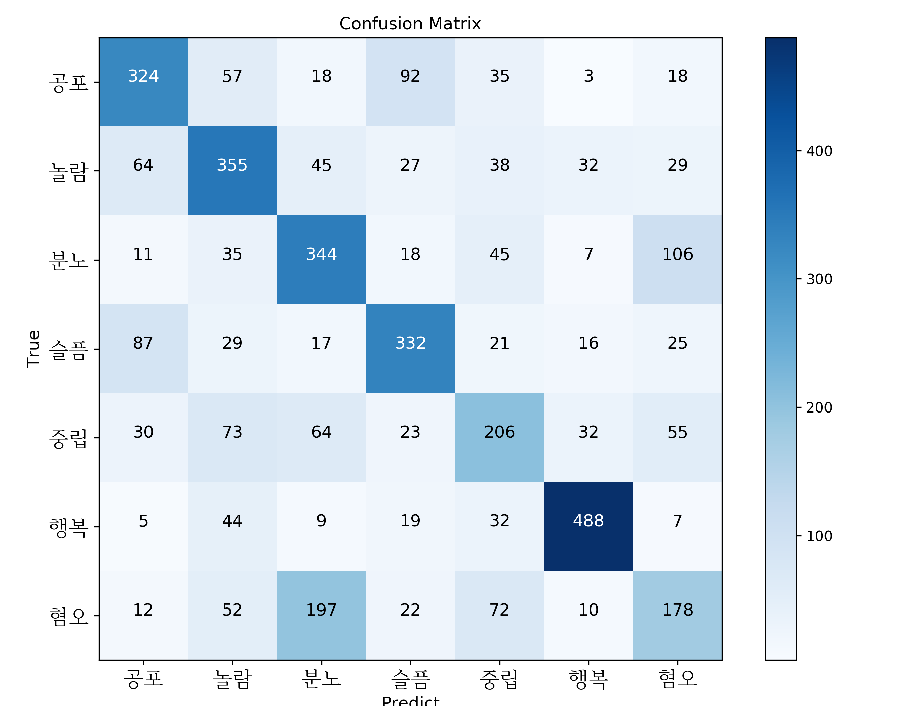
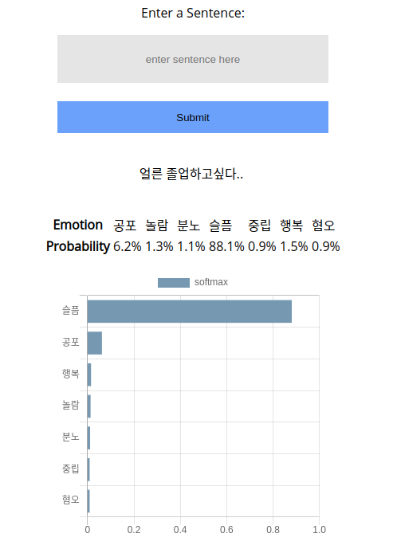

# Pytorch BERT Pretrain / Finetuning  
pytorch BERT Trainer using HuggingFace transformers   

## Requirements
- python 3.6   
- pytorch 1.12  
- cuda 10.0
- tensorflow 1.14 (for tensorboard)  
- pytorch_transformers  
- gluonnlp >= 0.6.0  
- apex (for mixed precision training)  
- flask (for using api)


Pretrained Korean Bert Model ([ETRI](http://aiopen.etri.re.kr/service_dataset.php) or [SKT](http://aiopen.etri.re.kr/service_dataset.php))  
Make directory `pretrained_model` and make sub directory like below  
```
pretrained_model
├── etri
│   ├── bert_config.json
│   ├── pytorch_model.bin
│   ├── tokenization.py
│   └── vocab.korean.rawtext.list
└── skt
    ├── bert_config.json
    ├── pytorch_model.bin
    ├── tokenizer.model
    └── vocab.json
```
## Datasets  
- [한국어 단발성 대화 데이터셋](http://aicompanion.or.kr/kor/tech/data.php)(공포, 놀람, 분노, 슬픔, 중립, 행복, 혐오)  
- Any Dataset containing binary label(긍정, 부정)  

Datasets should be in csv format which has two columns named 'Sentence' and 'Emotion'.  
Or you can modify a few codes below in `datasets.py` to fit your own datasets  
```python
...
# line 50 - 58
def get_data(self, file_path):
    data = pd.read_csv(file_path)
    corpus = data['Sentence']
    label = None
    try:
        label = [self.label2idx[l] for l in data['Emotion']]
    except:
        pass
    return corpus, label
...
```

## Usage  
For maksed language model pretrain  
```
$ python train_mlm.py\
        --pretrained_type="etri"
```  
  
For text classification  
```
$ python train_classification.py\
        --pretrained_type="etri"
```  

Classification after further MLM pretrain
```
$ python train_classification.py\
        --pretrained_model_path=".../best_model.bin"
```
  
Use fp16 argument for [mixed precision training](https://github.com/NVIDIA/apex)  
```
$ python train_classification.py\
        --fp16\
        --fp16_opt_level="O1"
```

## Result
**Overall**  

| Test Set(145,409) | |
| :---: | :---: |
| Accuracy | 57.69% |
| Macro F1 | 56.84% |

**F1 score for each Emotion**  

| Emotion | F1 |
| :---: | :---: |
| 공포 | 60.00% |
| 놀람 | 57.49% |
| 분노 | 54.60% |
| 슬픔 | 62.64% |
| 중립 | 44.21% |
| 행복 | 81.88% |
| 혐오 | 37.04% |

**Confusion matrix**  


## Simple Web Application with Flask  
```
$ python app.py
```  

Sad case             |  Happy case
:-------------------------:|:-------------------------:
  | 


